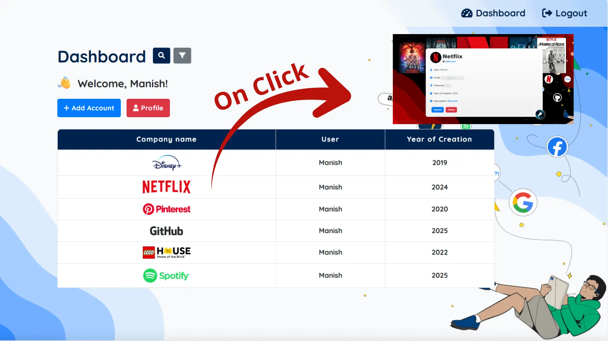

---

# NoteUp 📒


**NoteUp** is a Flask-based account manager with registration, login, account storage, Google OAuth, and inactivity logout.



## Features
- User registration and login
- Add, update, and delete accounts
- Password recovery via security questions
- Google OAuth
- Auto-logout after inactivity

## ✅ Two ways to try MAT
1) 🧪 Live Demo (Render)
Try the hosted demo here: https://mat-cs50.onrender.com/

Note: This demo uses ephemeral storage. Data resets on restarts, so links may stop working.

2) 💻 Run locally (LAN)
Run the app on your own network so files persist with MySQL and sharing works within your LAN.

## Quick Start
1. Clone the repo
2. Install dependencies: `pip install -r requirements.txt`
3. Set up `.env` with Google Client ID and Secret
4. Run: `python app.py`
5. Open: `http://127.0.0.1:5000`

## Folder Structure
```plaintext
NOTEUP_WEB/
│
├── company_info/
│   ├── company_logos.py
│   ├── company_banner.py
│   ├── circular_logos.py
│   ├── company_link.py
│   ├── company_categories.py
│
├── scripts/
│   ├── background.js
│   ├── company-config.js
│   ├── inactivity.js
│   ├── view.js
│
├── static/
├── templates/
│
├── .env
├── .gitignore
├── app.py
├── requirements.txt
```

## Adding Company Brands
1. Update Python files in `company_info/`
2. Update `scripts/company-config.js`
3. For all-caps names, edit `@app.template_filter('capitalize_full')` in `app.py`

## Customization
- Update profile picture URLs in `get_random_profile_picture`
- Modify UI in `templates/` and `static/`

---
