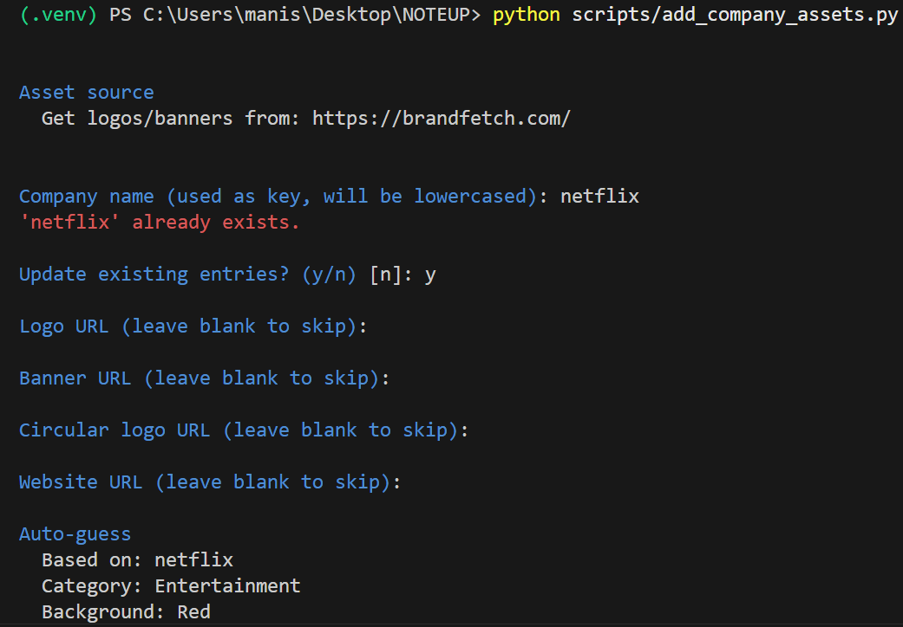

# NoteUp 📒
**NoteUp** is a Flask-based account manager with registration, login, account storage, Google OAuth (optional), and inactivity logout.


## Features
- User registration and login
- Add, update, and delete accounts
- Password recovery via security questions
- Google OAuth
- Auto-logout after inactivity (1 minute)
 


## ✅ Live Demo
Try the hosted demo here: [https://noteup-qej0.onrender.com/](https://noteup-qej0.onrender.com/)

Note: This demo uses ephemeral storage. Data resets on restarts, so created accounts may be lost.

## Quick Start (Local)
1. Clone the repo
2. Install dependencies: `pip install -r requirements.txt`
3. Create a `.env` file with a `SECRET_KEY` (required for sessions). Google OAuth keys are optional unless you plan to use Google login.

```env
SECRET_KEY=your-unique-secret
GOOGLE_CLIENT_ID=your-google-client-id   # optional
GOOGLE_CLIENT_SECRET=your-google-client-secret   # optional
```

4. Run: `python app.py`
5. Open: `http://127.0.0.1:5000`

To run the asset updater:
- `python scripts/add_company_assets.py`

## 📁 Folder Structure
```plaintext
NOTEUP_WEB/
│
├── company_info/
│   ├── company_logos.py
│   ├── company_banner.py
│   ├── circular_logos.py
│   ├── company_link.py
│   ├── company_categories.py
│
├── scripts/
│   ├── background.js
│   ├── company-config.js
│   ├── add_company_assets.py
│   ├── inactivity.js
│   ├── view.js
│
├── static/
├── templates/
│
├── .env
├── .gitignore
├── app.py
├── requirements.txt
```

## Adding Company Brands ➕
Use the asset updater to add or update company assets:
- `python scripts/add_company_assets.py`

If a company shows default images, the custom logo/banner is missing from the config files (defaults are a fallback). Get correct logo/banner URLs from https://brandfetch.com/ and add them via the updater.

The updater asks for URLs and inserts them into the correct config files automatically (no manual edits needed). Use the prompts to set logo, banner, circular logo, website, category, and background.



Tip: If a website doesn’t provide a high‑definition banner (or it looks pixelated), manually search for a higher‑quality banner and use that URL instead.

## Customization 🎨
- **Profile Pictures**: To add more profile images, append URLs in `get_random_profile_picture` inside [app.py](app.py).
- **Background Colors**: Background images are defined in [static/background-styles.css](static/background-styles.css). Add new CSS classes there, then map a company to a background set in [scripts/company-config.js](scripts/company-config.js). The updater can select from existing background sets, but it does not create new CSS classes.

## API Option
An API approach is possible, but the free tier allows only 100 requests/month and returns logos only (no banners). If desired, you can integrate the API to reduce manual image fetching within those limits.
